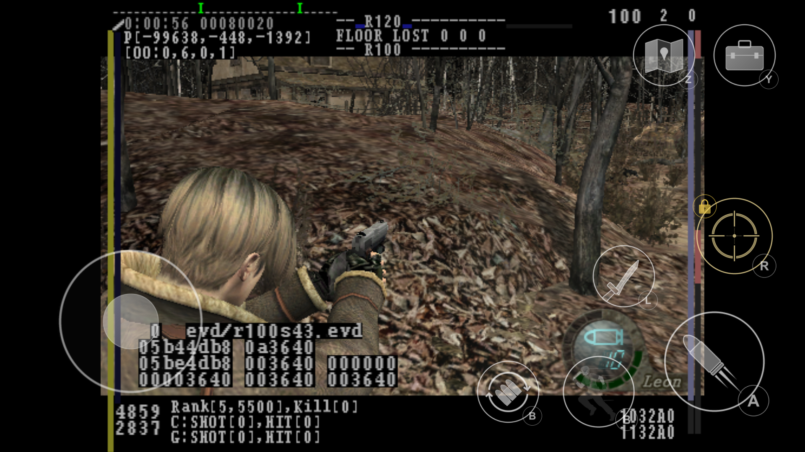
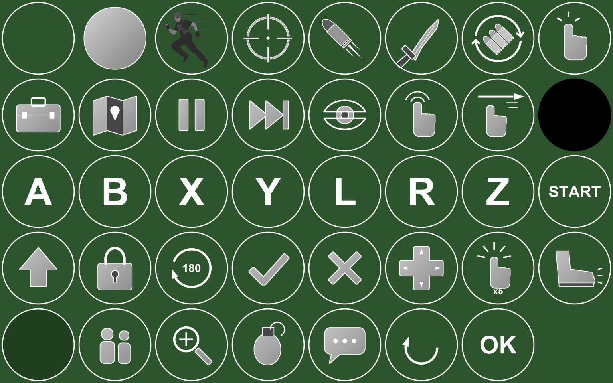

# Resident Evil 4 — Native Port (GameCube)

A native port of **Resident Evil 4 for the Nintendo GameCube** to **Windows** and **Android**.
There's no emulator: the game runs directly on your PC or phone.

> **No game data is included, and none ever will be. Bring your own disc.**
> The project is **closed source**. This repository hosts the releases, the issue tracker
> and the project news.

*Android, on a 2014 Samsung Galaxy S5, in the village, with touch controls. The text overlay is
the debug build's own HUD.*

---

## Status

| platform | state |
|---|---|
| **Windows** | Playable: village, textures, lighting, HUD, sound in game, **saves**. ~20 fps. No music or FMV yet |
| **Android** | Boots and draws the village on a real phone, with full touch controls. Too slow to play for now (~1-2 fps) |
| **iOS** | Planned, after Android |

Target build: the **Nov 25 2004 debug build** (G4BE08).

**Next step: a closed beta on the Discord.**

## What's new

- **Saves.** The memory card works: the game detects it, formats it, and saves and loads at
  the typewriters. The card is a single file next to the game, kept between sessions.
  Save/load is in its final round of testing.
- **Wii Edition features.** 16:9 widescreen, and **pointer-style aiming**: the crosshair follows
  your mouse or stick freely instead of the GameCube's slow laser.
- **Fixes:**
  - quitting from the loading screen (*Exit? → Yes*) no longer freezes the game;
  - the memory card is detected on every boot;
  - a low-level bug that silently affected about 500 places in the game's code is fixed;
  - disc reads and memory card transfers now behave like the real hardware, which removed
    several rare hangs.

## How you will play it

When the first release is out, you'll download a small **installer**. You point it at **your
own disc image**; it checks that the disc is the right one and **builds the game on your
computer from your disc**. Nothing from the game is ever downloaded from here.

- Windows: the installer produces the game executable.
- Android: the same installer, run on your PC, builds the app and installs it on your phone.

**There is no public release yet.** Watch the repository or join the Discord to know when
testing opens.

## The launcher

- **Version check:** on start, the launcher makes one read-only request to this repository to
  see whether a newer version is out. Nothing about you or your machine is sent. Old versions
  ask you to update, so everyone reports bugs on the same build.
- **Disc check:** your disc image is verified before anything is built. A wrong or damaged
  image is refused with a clear message.
- **Release builds are clean:** no console window, no debug log, no hidden developer options,
  on Windows and on Android.

## Touch controls (Android)

The buttons follow what the game is doing, whether you're exploring, aiming, in a QTE, in a menu,
in the attaché case or in a cutscene:
- floating stick, and a run button you can lock with a double tap;
- aim, fire, knife, reload, attaché case, map and quick turn;
- QTEs become **tap / swipe / mash** prompts, including the boulder chase;
- tap menu text directly; tap an item in the attaché case, then *Equip*;
- a skip button that only appears in cutscenes.

## Roadmap

1. Closed beta on the Discord (Windows first).
2. Music and FMV cutscenes.
3. Performance, on PC and above all on Android, to make it playable on phones.
4. Public release of the installer.
5. iOS.

## Reporting bugs

Open an issue with your platform, device or GPU, what you were doing, and a screenshot if you
can. **Never attach game files, disc images or save files.**

## Legal

- This project is **not affiliated with or endorsed by Capcom or Nintendo**. *Resident Evil* is a
  trademark of Capcom.
- **No game data, ISOs or game code are distributed**, here or anywhere else. Requests for
  them will be closed.
- Non-commercial: no paid versions, no subscriptions, no ads.

## Credits

- **Volodymyr Vovchok / BlackLine Interactive**: [NWiiRecomp](https://github.com/BlackLineInteractive/NWiiRecomp),
  the recompiler this port is built on. Used under its license: non-commercial use, with
  attribution.
- The **RE4 GameCube decompilation** project.
- **SDL2**, for windowing, input and audio.
- **Dear ImGui**, for the launcher and in-game menus.
- **Dolphin** and **YAGCD**, for GameCube hardware documentation.
- **Dusklight**, **melee-pc**, **UnleashedRecomp-Android**, **N64Recomp / PS2Recomp**: for
  inspiration and their public notes.

## Community

Discord: https://discord.gg/AXAzExECSv

*— ayano*
